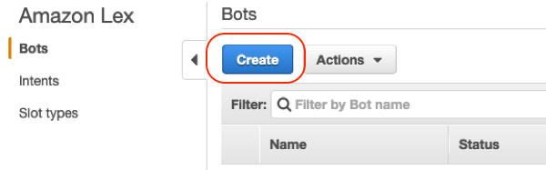
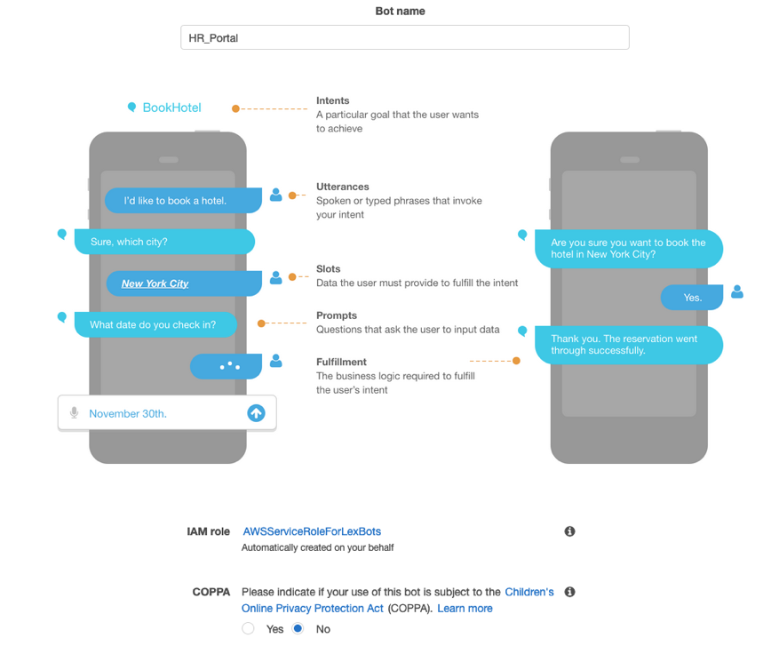
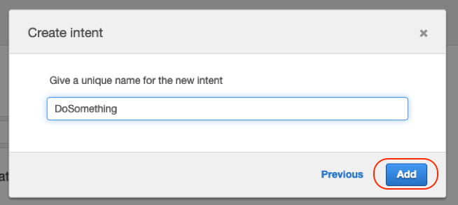
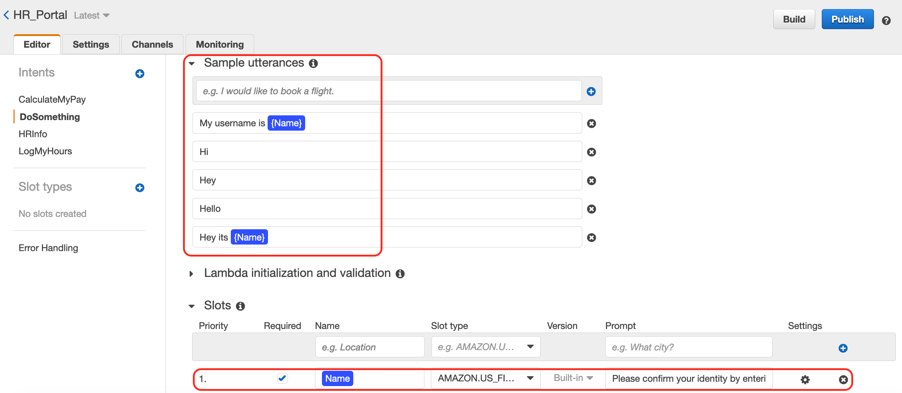
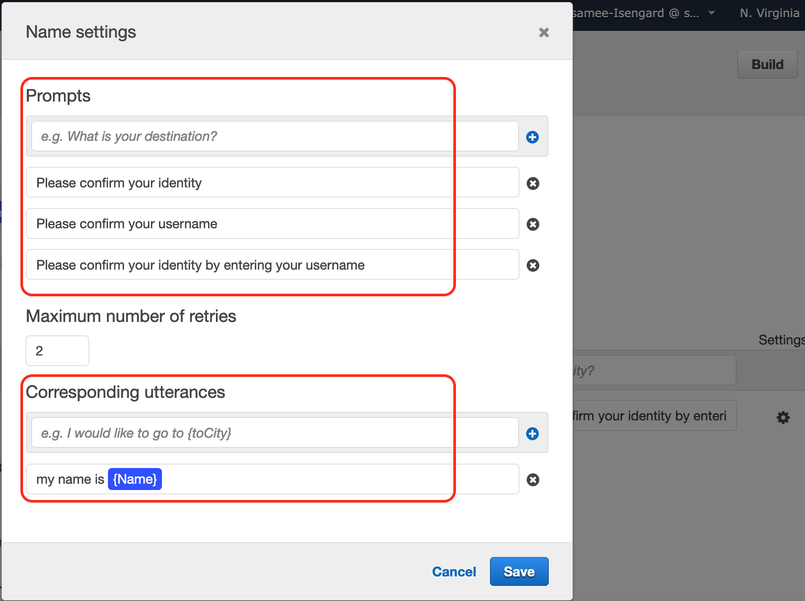
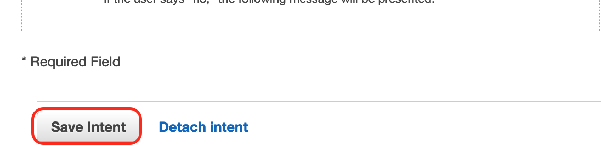
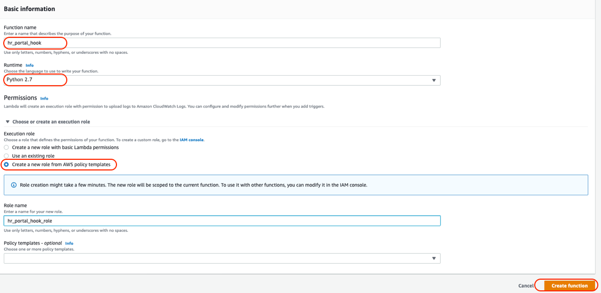

## Use Case 1 - Greet the user with welcome message and HR menu options - Lambda Fulfilment
We need to do following:
1. Create Lex chat bot 
2. Create a lambda function that can fulfil Lex responses

## Reference docs:
You can open these docs for further information
Create an Amazon Lex Bot (Console) - https://docs.aws.amazon.com/lex/latest/dg/gs-bp-create-bot.html
Create a Lambda Function (Console) - https://docs.aws.amazon.com/lex/latest/dg/gs-bp-create-lambda-function.html

## Demo:

 
## Steps:

### Navigate to Lex service in AWS Console

1.	Create a new chatbot
 


2.	Enter the bot name HR_Portal, COPPA as No and hit create 
 
 

3.	Create intent
 

4.	Now Create
-	Utterances – Hi, Hey, Hello
-	Slots – Name: Name, Slot Type: AMAON.US_FIRST_NAME


Click gear icon and put some Promts like:
- Please confirm your identity
- Please confirm your username
- Please confirm your identity by entering your username

Corresponding utterances:
- my name is ​{Name}​


5. Save


### Navigate to Lambda service in new tab
6.	Create a new lambda function with 2.7 python as Runtime language and Create new role

  
6.	Copy code from Lab1_Mod1.py in Lambda editor

7.	Configure sample test event to test the code

``` 
{
  "messageVersion": "1.0",
  "invocationSource": "DialogCodeHook",
  "userId": "tast_user",
  "sessionAttributes": {},
  "bot": {
    "name": "HR_Bot",
    "alias": "$LATEST",
    "version": "$LATEST"
  },
  "outputDialogMode": "Text",
  "currentIntent": {
    "name": "DoSomething",
    "slots": {
      "Name": "laxmi"
    },
    "confirmationStatus": "None"
  },
  "inputTranscript": "This is ok"
}
```

Add more prompts and corresponding utterances to the slot, remember to BUILD again
 
Test your bot

Refer this page to understand code https://docs.aws.amazon.com/lex/latest/dg/lambda-input-response-format.html

##  Function involved
Refer this page to understand code https://docs.aws.amazon.com/lex/latest/dg/lambda-input-response-format.html
```
def do_this(intent_request):
    # get the value of Name slot provided by Lex interface
    name = intent_request['currentIntent']['slots']["Name"]
    source = intent_request['invocationSource']

    # return closer of the intent
    return close(intent_request['sessionAttributes'],
                 'Fulfilled',
                 {'contentType': 'PlainText',
                  'content': 'Hey {}!, I am Lex. \n\nNice to meet you! :) You can try HR portal functionalities: \n 1. Log my hours \n 2. Calculate my pay \n 3. Faq'.format(name)})
```