# User authentication and validation against identity database (DynamoDB in our case) - Lambda Validation
do_this() include the validation function validate_name()

## Demo:
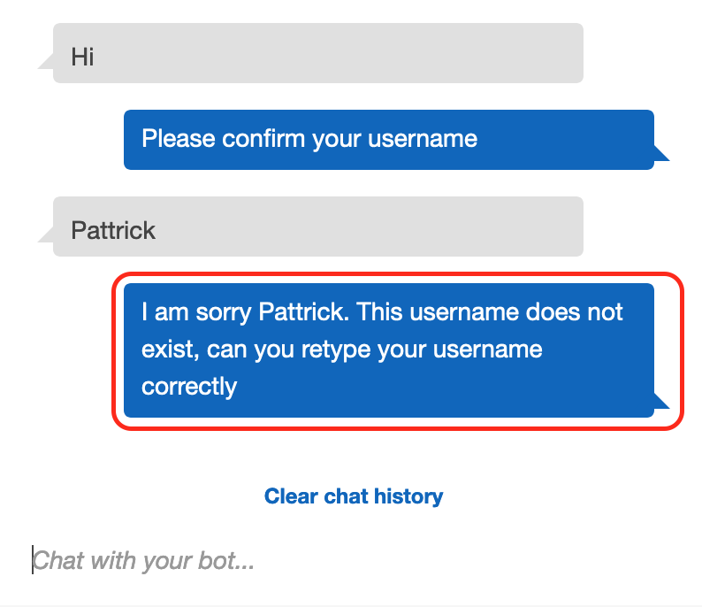

## We need to do following:
1.	We want Lambda to talk to Dynamodb to need to attach dynamodb policy to the lambda role
2.	Jypytur notebook installed on local is great to test dynamodb sql (https://www.chrisjmendez.com/2018/11/06/installing-jupyter-on-os-x-using-homebrew/)
3.	Create a DynamoDB table

## New functions introduced here:
- elicit_slot: Informs Amazon Lex that the user is expected to provide a slot value in the response.
- delegate: Directs Amazon Lex to choose the next course of action based on the bot configuration.
- validate_friend: Validate the friend from a list
- build_validation_result: Return response to Lex with or without defined return message
Reference : https://docs.aws.amazon.com/lex/latest/dg/lambda-input-response-format.html

## Functions
```
def do_this(intent_request):
    # get the value of Name slot provided by Lex interface
    name = intent_request['currentIntent']['slots']["Name"]
    source = intent_request['invocationSource']
    
    if source == 'DialogCodeHook':
        # Perform basic validation on the supplied input slots.
        # Use the elicitSlot dialog action to re-prompt for the first violation detected.
        slots = get_slots(intent_request)
        validation_result = validate_name(name)
        if not validation_result['isValid']:
            slots[validation_result['violatedSlot']] = None
            return elicit_slot(intent_request['sessionAttributes'],
                               intent_request['currentIntent']['name'],
                               slots,
                               validation_result['violatedSlot'],
                               validation_result['message'])
        
        output_session_attributes = intent_request['sessionAttributes'] if intent_request['sessionAttributes'] is not None else {}
        return delegate(output_session_attributes, get_slots(intent_request))
    # return closer of the intent
    return close(intent_request['sessionAttributes'],
                 'Fulfilled',
                 {'contentType': 'PlainText',
                  'content': 'Hey {}!, I am Lex. \n\nNice to meet you! :) You can try HR portal functionalities: \n 1. Log my hours \n 2. Calculate my pay \n 3. Faq'.format(name)
                 }
                 )
```
### Validation function
```
def validate_name(name):
    friends = ['srinivas', 'laxmi']
    #friends=find_name_in_ddb(name)
    if name is not None and name.lower() not in friends:
        return build_validation_result(False,
                                       'Name',
                                       'I am sorry {}. This username does not exist, can you retype your username correctly'.format(name))
    
    return build_validation_result(True, None, None)
```

### Configure Event to test this function in lambda
this is same event used in use-case 1, change the values according to your data
```
{
  "messageVersion": "1.0",
  "invocationSource": "DialogCodeHook",
  "userId": "tast_user",
  "sessionAttributes": {},
  "bot": {
    "name": "HR_Bot",
    "alias": "$LATEST",
    "version": "$LATEST"
  },
  "outputDialogMode": "Text",
  "currentIntent": {
    "name": "DoSomething",
    "slots": {
      "Name": "laxmi"
    },
    "confirmationStatus": "None"
  },
  "inputTranscript": "This is awesome"
}
```
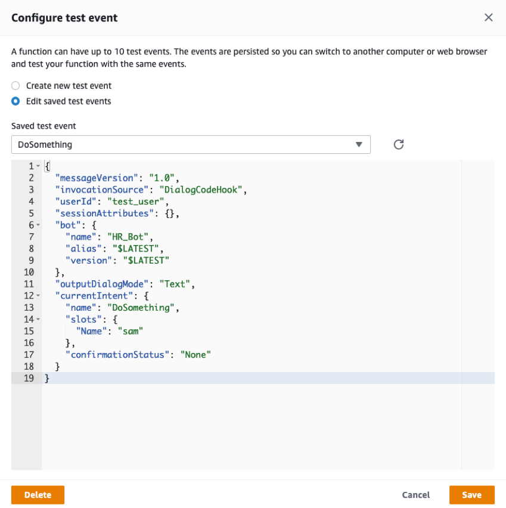

The above function right now validates on a list of names, but we can enhance our use case with validating against username database.

## Steps
1.	Add a Dynamodb permissions to Lambda
> Navigate to IAM role attached to lambda - View the HR_portal_Lex_role in IAM console
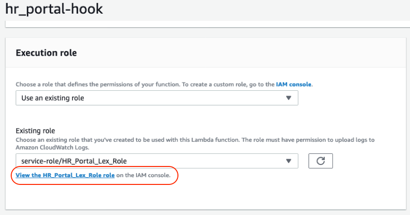

> Attach policy
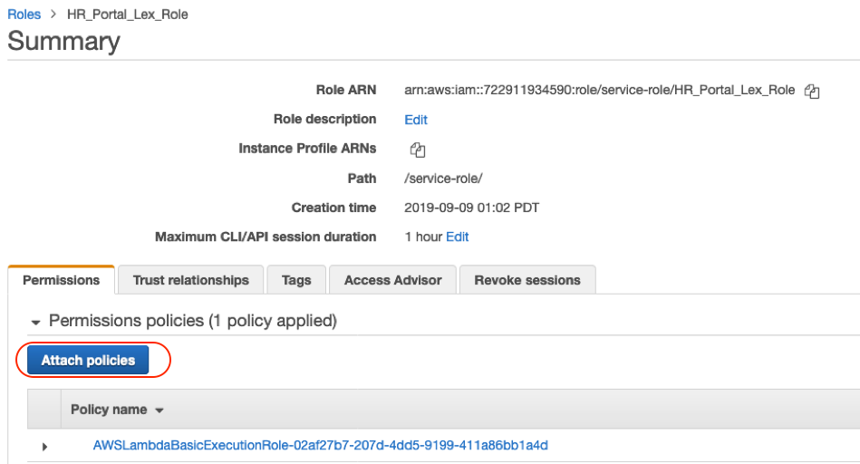
 
> Dynamodb full access
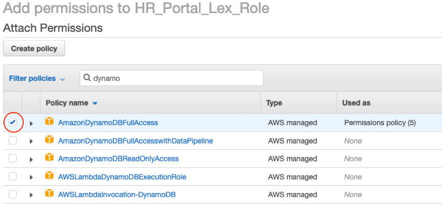

Save this role.

2. Create DynamoDB table, navigate to DynamoDB console
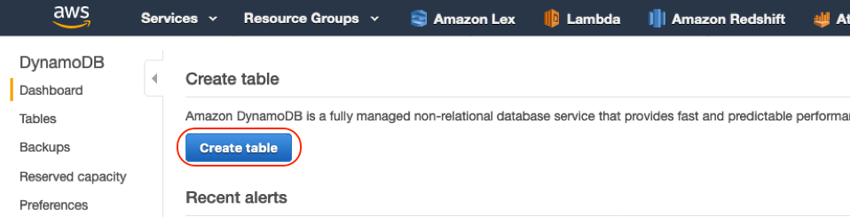

- Primary key as ‘name’


- Create Item

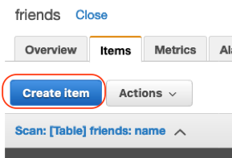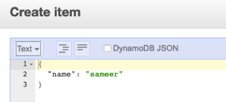

- Repeat to enter some example names
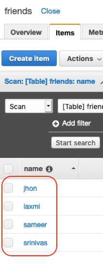
  
You are now ready to query from dynamodb table using Jupyter notebook in following steps or using lambda function, refer below for syntax.
Ref: https://docs.aws.amazon.com/amazondynamodb/latest/developerguide/GettingStarted.Python.03.html

3. Testing code in Jupyter notebook

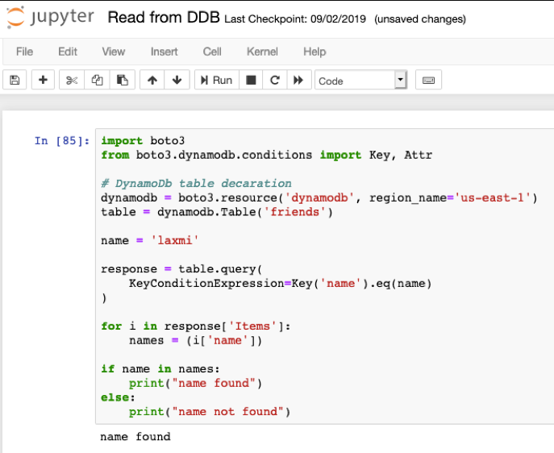

```
import boto3
from boto3.dynamodb.conditions import Key, Attr

# DynamoDb table decaration
dynamodb = boto3.resource('dynamodb', region_name='us-east-1')
table = dynamodb.Table('friends')

name = 'laxmi'

response = table.query(
    KeyConditionExpression=Key('name').eq(name)
)

for i in response['Items']:
    names = (i['name'])

if name in names:
    print("name found")
else:
    print("name not found")

```
4. Search from DynamoDB table function

```
def find_name_in_ddb(name):
    friends_table = dynamodb.Table('friends')
    name = str(name)
    response = friends_table.query(
        KeyConditionExpression=Key('name').eq(name)
        )
    names=[]
    for i in response['Items']:
        names = (i['name'].lower())
    
    return(names)
```

Now uncomment the section of dynamoDB and comment the list in our validation function
```
    #friends = ['srinivas', 'laxmi']
    friends=find_name_in_ddb(name)
```

Test again with the configured event
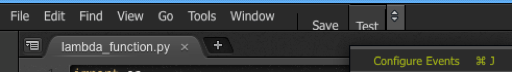