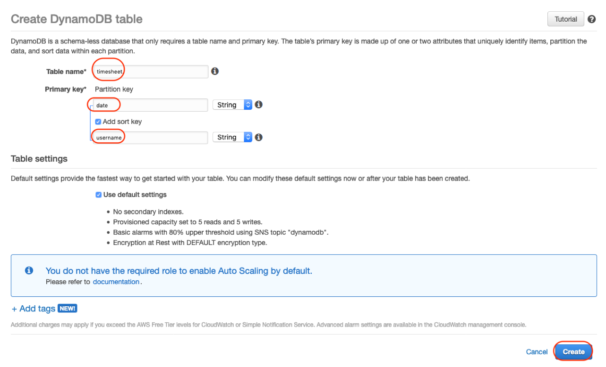
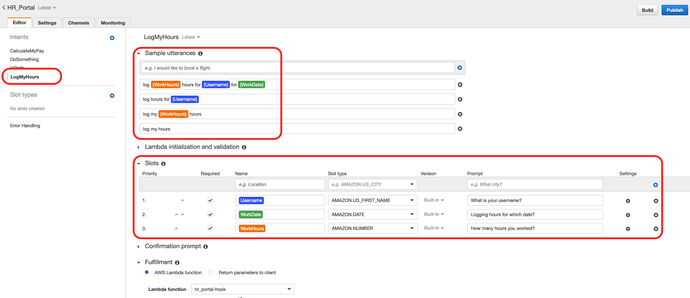

# Log in working hours, validate date and working hours
Log work hours and validate for invalid date or number of hours

## Demo

> validate date

> validate hours


## We need to do following:
1.	Create a dynamodb table called timesheet
2.	Put item in this table based on user interaction

## Functions introduced:
logMyHours()
validate_logMyHours()
putItemInDDB()

## Steps
1. Create a dynamodb table


2. Create new intent log my hours, see sample uttrances and slot types from image below


## Functions
```
def logMyHours(intent_request):
    work_hours = safeDecimal(get_slots(intent_request)["WorkHours"])
    work_date = get_slots(intent_request)["WorkDate"]
    user_name = safeString(get_slots(intent_request)["Username"])
    source = intent_request['invocationSource']
    logger.debug('user_name is {}'.format(user_name))
    user_name=safeString(user_name)
    if source == 'DialogCodeHook':
        slots = get_slots(intent_request)
        validation_result = validate_logMyHours(user_name,work_date, work_hours)
        
        if not validation_result['isValid']:
            slots[validation_result['violatedSlot']] = None
            return elicit_slot(intent_request['sessionAttributes'],
                               intent_request['currentIntent']['name'],
                               slots,
                               validation_result['violatedSlot'],
                               validation_result['message'])
        
        output_session_attributes = intent_request['sessionAttributes'] if intent_request['sessionAttributes'] is not None else {}
        return delegate(output_session_attributes, get_slots(intent_request))                   

    putItemInDDB(work_hours,work_date,user_name)
    
    return close(intent_request['sessionAttributes'],
                 'Fulfilled',
                 {'contentType': 'PlainText',
                  'content': ' Thank you {}!. Your {} hours for {} have been logged'.format(user_name, work_hours, work_date)})
```
### validate function
```
def validate_logMyHours(user_name,work_date, work_hours):
    
    if work_hours is not None:
        if work_hours < 0 or work_hours > 8:
            return build_validation_result(False, 'WorkHours', 'You can log upto 8 hours per shift, please reenter work hours for this day')
    
    date=work_date  
    if date is not None:
        if not isvalid_date(date):
            return build_validation_result(False, 'WorkDate', 'I did not understand that, please retype date')
        elif datetime.datetime.strptime(date, '%Y-%m-%d').date() > datetime.date.today():
            return build_validation_result(False, 'WorkDate', 'You can not log hours for future date, please retype date')

    return build_validation_result(True, None, None)
```

### Put item in DDB

```
def putItemInDDB(work_hours,work_date,user_name):
    w_hours = work_hours
    w_date = work_date
    user = user_name.lower()
    
    table = dynamodb.Table('timesheet')
    put_response = table.put_item(
       Item={
            'date': w_date,
            'username': user,
            'workhours': w_hours
        }
    )
    return (put_response ["ResponseMetadata"]["HTTPStatusCode"])
```

 ## Configure test event
 change the values according to your data
 ```
 {
  "messageVersion": "1.0",
  "invocationSource": "DialogCodeHook",
  "userId": "test_user",
  "sessionAttributes": {},
  "bot": {
    "name": "HR_Bot",
    "alias": "$LATEST",
    "version": "$LATEST"
  },
  "outputDialogMode": "Text",
  "currentIntent": {
    "name": "LogMyHours",
    "slots": {
      "Username": "Laxmi",
      "WorkDate": "2019-10-09",
      "WorkHours": 7
    },
    "confirmationStatus": "None"
  },
  "inputTranscript": "This is awesome"
}
 ```

 You should test dynmoDB function in jupyter notebook first and then test lambda using events and then actual bot

