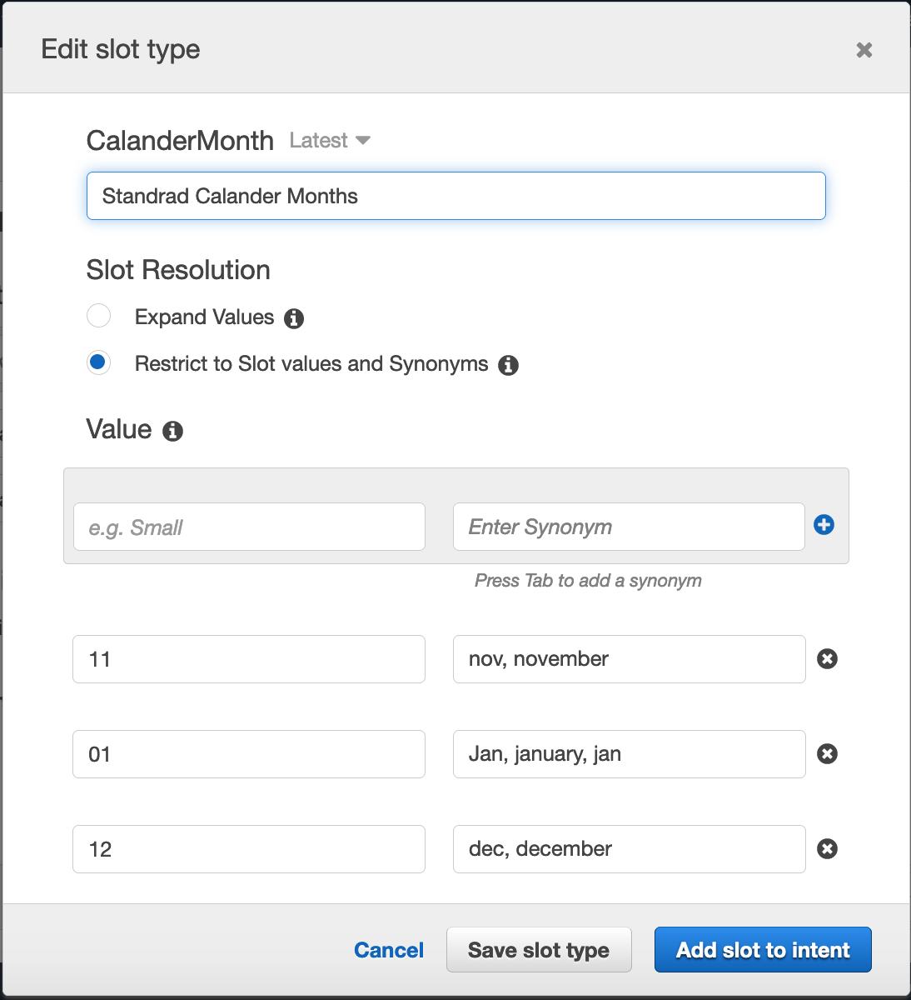

# Calculate pay in a particular month, validate if existing user
Calculate pay based on username for a particular month and year.

## Demo

> validate if existing user


## We need to do following:
1. Create customer slot type month
2. Write a function to Get item in DDB table based on user provided date

## Custom slot type


## Functions
```
def calcMyPay(intent_request):
    work_month = get_slots(intent_request)["WorkMonth"]
    work_year = get_slots(intent_request)["WorkYear"]
    user_name = safeString(get_slots(intent_request)["Username"])
    source = intent_request['invocationSource']
    
    if source == 'DialogCodeHook':

        slots = get_slots(intent_request)
        validation_result = validate_username(user_name)
        if not validation_result['isValid']:
            slots[validation_result['violatedSlot']] = None
            return elicit_slot(intent_request['sessionAttributes'],
                               intent_request['currentIntent']['name'],
                               slots,
                               validation_result['violatedSlot'],
                               validation_result['message'])
        
        output_session_attributes = intent_request['sessionAttributes'] if intent_request['sessionAttributes'] is not None else {}
        return delegate(output_session_attributes, get_slots(intent_request))

    total_hours=scanItemFromDDB(work_year,work_month,user_name)
    total_pay=total_hours*25 #better salary logic
    
    return close(intent_request['sessionAttributes'],
                 'Fulfilled',
                 {'contentType': 'PlainText',
                  'content': '{} your total pay for {}/{} is ${}. You have worked {} hours this month'.format(user_name,work_month,work_year,total_pay,total_hours)})

```
### validate username
```
def validate_username(name):
    #friends = ['srinivas', 'laxmi']
    usernames=scanUsernameInDDB(name)
    if name is not None and name.lower() not in usernames:
        return build_validation_result(False,
                                       'Username',
                                       'I am sorry {}. You are not a registered user. Please retrype username'.format(name))
    
    return build_validation_result(True, None, None)
```
### Calculate total hours
```
def scanItemFromDDB(work_year,work_month,user_name):

    user = user_name
    month_year = str(work_year)+'-'+str(work_month)
    table = dynamodb.Table('timesheet')
    fe = Attr('date').contains(month_year) & Attr('username').eq(user)
    pe = ("#ddate, workhours")
    ean = { "#ddate": "date", }
    
    read_response = table.scan(
        FilterExpression=fe,
        ProjectionExpression=pe,
        ExpressionAttributeNames= ean
    )
    total_hours=0
    for i in read_response[u'Items']:
        total_hours += decimal.Decimal(i['workhours'])
    
    return(total_hours)
```
## Configure test event
change the values according to your data
```
{
  "messageVersion": "1.0",
  "invocationSource": "DialogCodeHook",
  "userId": "test_user",
  "sessionAttributes": {},
  "bot": {
    "name": "HR_Bot",
    "alias": "$LATEST",
    "version": "$LATEST"
  },
  "outputDialogMode": "Text",
  "currentIntent": {
    "name": "CalculateMyPay",
    "slots": {
      "Username": "sameer",
      "WorkMonth": "09",
      "WorkYear": "2019"
    },
    "confirmationStatus": "None"
  },
  "inputTranscript": "This is awesome"
}
```

## Code
```
import os
import time
import logging
import boto3
import decimal
import dateutil.parser
import datetime
from boto3.dynamodb.conditions import Key, Attr

# Logger
logger = logging.getLogger()
logger.setLevel(logging.DEBUG)
# DynamoDb table decaration
dynamodb = boto3.resource('dynamodb', region_name='us-east-1')
# Client for Comprehend
client = boto3.client('comprehend')
"""
Helper function for Lex
"""  
def get_slots(intent_request):
    return intent_request['currentIntent']['slots']

def safeString(n):
    """
    Safely convert n value to string.
    """
    if n is not None:
        return str(n)
    return (n)
    
#Close: Informs Amazon Lex not to expect a response from the user. Just return any final message from Lambda to Lex
def close(session_attributes, fulfillment_state, message):
    response = {
        'sessionAttributes': session_attributes,
        'dialogAction': {
            'type': 'Close',
            'fulfillmentState': fulfillment_state,
            'message': message
        }
    }
    return response
    
# ElicitIntent: Informs Amazon Lex that the user is expected to respond with an utterance that includes an intent. 
def elicit_slot(session_attributes, intent_name, slots, slot_to_elicit, message):
    return {
        'sessionAttributes': session_attributes,
        'dialogAction': {
            'type': 'ElicitSlot',
            'intentName': intent_name,
            'slots': slots,
            'slotToElicit': slot_to_elicit,
            'message': message
        }
    }

#Delegate: Directs Amazon Lex to choose the next course of action based on the bot configuration.
def delegate(session_attributes, slots):
    return {
        'sessionAttributes': session_attributes,
        'dialogAction': {
            'type': 'Delegate',
            'slots': slots
        }
    }

# return response to Lex with/without defined return message
def build_validation_result(is_valid, violated_slot, message_content):
    if message_content is None:
        return {
            "isValid": is_valid,
            "violatedSlot": violated_slot,
        }

    return {
        'isValid': is_valid,
        'violatedSlot': violated_slot,
        'message': {'contentType': 'PlainText', 'content': message_content}
    }
    
"""
Functions to validate the user input
"""
def validate_username(name):
    #friends = ['srinivas', 'laxmi']
    usernames=scanUsernameInDDB(name)
    if name is not None and name.lower() not in usernames:
        return build_validation_result(False,
                                       'Username',
                                       'I am sorry {}. You are not a registered user. Please retrype username'.format(name))
    
    return build_validation_result(True, None, None)
        
"""
Dynamodb Functions read or write values
"""
def scanUsernameInDDB(user_name):
    table = dynamodb.Table('timesheet')
    user = user_name
    
    fe = Attr('username').eq(user)
    pe = ("username")
    
    read_response = table.scan(
        FilterExpression=fe,
        ProjectionExpression=pe
    )
    usernames=[]
    for i in read_response['Items']:
        usernames = (i['username'].lower())
        
    return(usernames)
    
def scanItemFromDDB(work_year,work_month,user_name):

    user = user_name
    month_year = str(work_year)+'-'+str(work_month)
    table = dynamodb.Table('timesheet')
    fe = Attr('date').contains(month_year) & Attr('username').eq(user)
    pe = ("#ddate, workhours")
    ean = { "#ddate": "date", }
    
    read_response = table.scan(
        FilterExpression=fe,
        ProjectionExpression=pe,
        ExpressionAttributeNames= ean
    )
    total_hours=0
    for i in read_response[u'Items']:
        total_hours += decimal.Decimal(i['workhours'])
    
    return(total_hours)

"""
Functions to fulfill intent
"""
def calcMyPay(intent_request):
    work_month = get_slots(intent_request)["WorkMonth"]
    work_year = get_slots(intent_request)["WorkYear"]
    user_name = safeString(get_slots(intent_request)["Username"])
    source = intent_request['invocationSource']
    
    if source == 'DialogCodeHook':

        slots = get_slots(intent_request)
        validation_result = validate_username(user_name)
        if not validation_result['isValid']:
            slots[validation_result['violatedSlot']] = None
            return elicit_slot(intent_request['sessionAttributes'],
                               intent_request['currentIntent']['name'],
                               slots,
                               validation_result['violatedSlot'],
                               validation_result['message'])
        
        output_session_attributes = intent_request['sessionAttributes'] if intent_request['sessionAttributes'] is not None else {}
        return delegate(output_session_attributes, get_slots(intent_request))

    total_hours=scanItemFromDDB(work_year,work_month,user_name)
    total_pay=total_hours*25 #better salary logic
    
    return close(intent_request['sessionAttributes'],
                 'Fulfilled',
                 {'contentType': 'PlainText',
                  'content': '{} your total pay for {}/{} is ${}. You have worked {} hours this month'.format(user_name,work_month,work_year,total_pay,total_hours)})
            
#############################################################################################################
def dispatch(intent_request):
    """
    Called when the user specifies an intent for this bot.
    """
    logger.debug('dispatch userId={}, intentName={}'.format(intent_request['userId'], intent_request['currentIntent']['name']))
    intent_name = intent_request['currentIntent']['name']

    # Dispatch to your bot's intent handlers
    if intent_name == 'DoSomething':
        return do_this(intent_request)
    elif intent_name == 'LogMyHours':
        return logMyHours(intent_request)
    elif intent_name == 'CalculateMyPay':
        return calcMyPay(intent_request)
    elif intent_name == 'HRInfo':
        return hrInfo(intent_request)

    raise Exception('Intent with name ' + intent_name + ' not supported')

def lambda_handler(event, context):
    """
    Route the incoming request based on intent.
    The JSON body of the request is provided in the event slot.
    """
    # By default, treat the user request as coming from the America/New_York time zone.
    os.environ['TZ'] = 'America/New_York'
    time.tzset()

    # Check for sentiment
    sentiment=client.detect_sentiment(Text=event['inputTranscript'],LanguageCode='en')['Sentiment']
    if sentiment=='NEGATIVE':
        return close({},
                 'Fulfilled',
                 {'contentType': 'PlainText',
                  'content': 'I am sorry. Seems like you are having troubles with our chat service. Let me transfer you to the a human support.'}) #trigger a call to human support
    return dispatch(event)
```