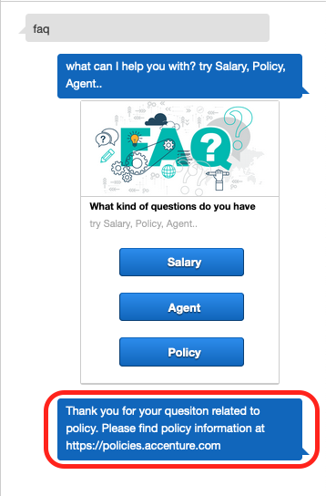
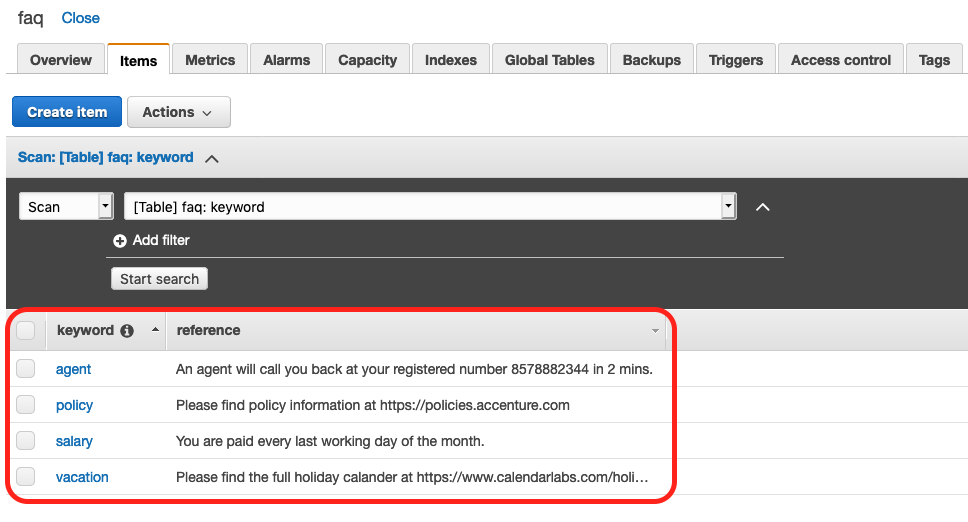
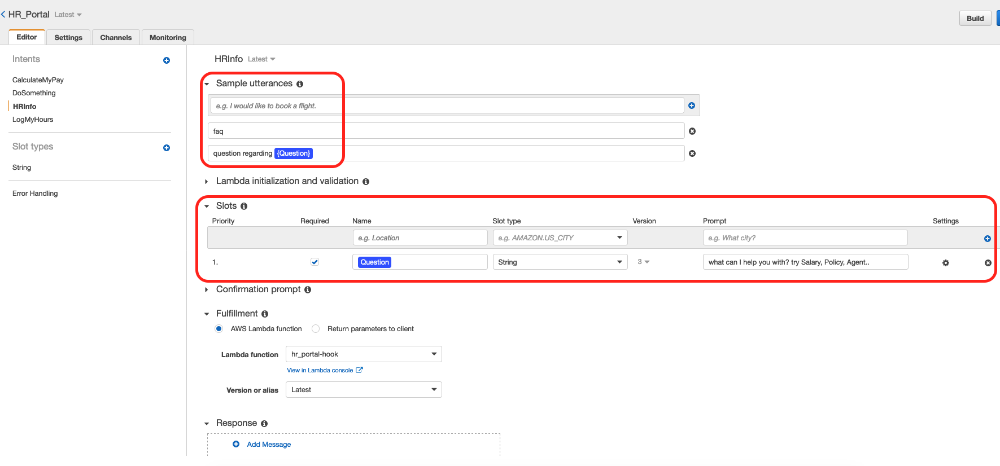
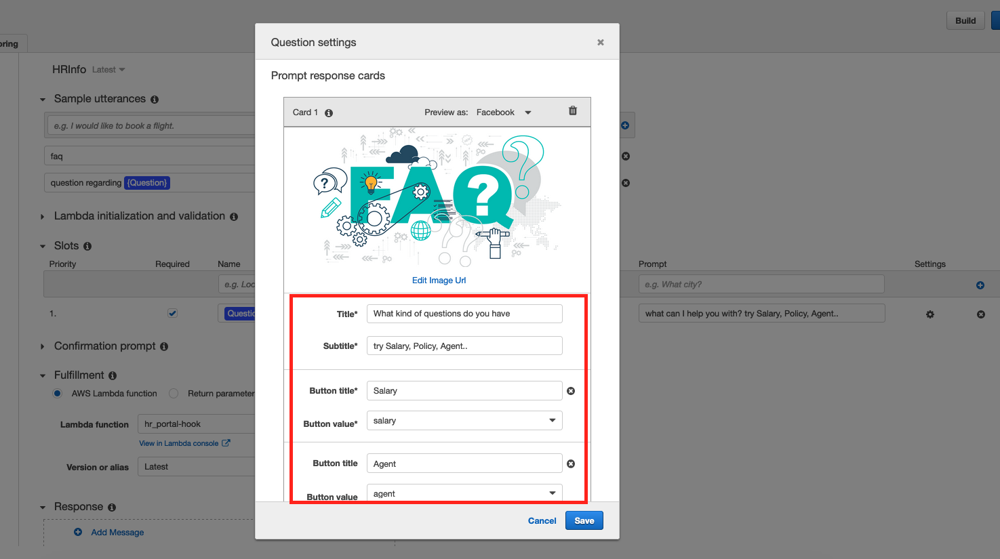

# Search common FAQs related to HR services
Search for commong searched questions ike Policy, Salary, Agent

## Demo



## We need to do following:
1. Create a DynamoDB table with name faq and with 
2. Write a search function that can extract the keywords from user input and search against DDB

## Steps
Navigate to DynamoDB console and create table as below


Create some items for faq keywords


## Intent


## Slot


## Functions
```
def hrInfo(intent_request):
    ques = safeString(get_slots(intent_request)["Question"])
    source = intent_request['invocationSource']
    ques=ques.lower()
    
    keyword="agent"  # if user put of some new quesiton, let connect him to human at the end

    if (ques.find("agent")>-1):
        keyword="agent"
    if (ques.find("policy")>-1):
        keyword="policy"
    if (ques.find("salary")>-1):
        keyword="salary"
    if (ques.find("vacation")>-1):
        keyword="vacation"
   
    faq_result=scanFAQ(keyword)
    
    return close(intent_request['sessionAttributes'],
                 'Fulfilled',
                 {'contentType': 'PlainText',
                  'content': 'Thank you for your quesiton related to {}.\n\n{}'.format(keyword,faq_result)})
```

## Configure test event
```
{
  "messageVersion": "1.0",
  "invocationSource": "DialogCodeHook",
  "userId": "test_user",
  "sessionAttributes": {},
  "bot": {
    "name": "HR_Bot",
    "alias": "$LATEST",
    "version": "$LATEST"
  },
  "outputDialogMode": "Text",
  "currentIntent": {
    "name": "HRInfo",
    "slots": {
      "Question": "policy"
    },
    "confirmationStatus": "None"
  },
  "inputTranscript": "This is awesome"
}
```

## Code
Functions to look for:
hrInfo(intent_request)
scanFAQ(keyword)

```
import os
import time
import logging
import boto3
import decimal
import dateutil.parser
import datetime
from boto3.dynamodb.conditions import Key, Attr

# Logger
logger = logging.getLogger()
logger.setLevel(logging.DEBUG)
# DynamoDb table decaration
dynamodb = boto3.resource('dynamodb', region_name='us-east-1')
# Client for Comprehend
client = boto3.client('comprehend')
"""
Helper function for Lex
"""  
def get_slots(intent_request):
    return intent_request['currentIntent']['slots']

def safeString(n):
    """
    Safely convert n value to string.
    """
    if n is not None:
        return str(n)
    return (n)
    
#Close: Informs Amazon Lex not to expect a response from the user. Just return any final message from Lambda to Lex
def close(session_attributes, fulfillment_state, message):
    response = {
        'sessionAttributes': session_attributes,
        'dialogAction': {
            'type': 'Close',
            'fulfillmentState': fulfillment_state,
            'message': message
        }
    }
    return response
        
"""
Dynamodb Functions read or write values
"""
def scanFAQ(keyword):
    faq_table = dynamodb.Table('faq')
    
    response = faq_table.query(
        KeyConditionExpression=Key('keyword').eq(keyword)
        )
    results=""
    for i in response['Items']:
        results = (i['reference'])
    
    return(results)

"""
Functions to fulfill intent
"""
def hrInfo(intent_request):
    ques = safeString(get_slots(intent_request)["Question"])
    source = intent_request['invocationSource']
    ques=ques.lower()
    
    keyword="default"
    if (ques.find("agent")>-1):
        keyword="agent"
    if (ques.find("policy")>-1):
        keyword="policy"
    if (ques.find("salary")>-1):
        keyword="salary"
    if (ques.find("vacation")>-1):
        keyword="vacation"
    # if user put of some new quesiton, let connect him to human at the end
    if keyword=="default":
        keyword="agent"
    
    faq_result=scanFAQ(keyword)
    
    return close(intent_request['sessionAttributes'],
                 'Fulfilled',
                 {'contentType': 'PlainText',
                  'content': 'Thank you for your quesiton related to {}.\n\n{}'.format(keyword,faq_result)})

#############################################################################################################
def dispatch(intent_request):
    """
    Called when the user specifies an intent for this bot.
    """
    logger.debug('dispatch userId={}, intentName={}'.format(intent_request['userId'], intent_request['currentIntent']['name']))
    intent_name = intent_request['currentIntent']['name']

    # Dispatch to your bot's intent handlers
    if intent_name == 'DoSomething':
        return do_this(intent_request)
    elif intent_name == 'LogMyHours':
        return logMyHours(intent_request)
    elif intent_name == 'CalculateMyPay':
        return calcMyPay(intent_request)
    elif intent_name == 'HRInfo':
        return hrInfo(intent_request)

    raise Exception('Intent with name ' + intent_name + ' not supported')

def lambda_handler(event, context):
    """
    Route the incoming request based on intent.
    The JSON body of the request is provided in the event slot.
    """
    # By default, treat the user request as coming from the America/New_York time zone.
    os.environ['TZ'] = 'America/New_York'
    time.tzset()

    # Check for sentiment
    sentiment=client.detect_sentiment(Text=event['inputTranscript'],LanguageCode='en')['Sentiment']
    if sentiment=='NEGATIVE':
        return close({},
                 'Fulfilled',
                 {'contentType': 'PlainText',
                  'content': 'I am sorry. Seems like you are having troubles with our chat service. Let me transfer you to the a human support.'}) #trigger a call to human support
    return dispatch(event)
```