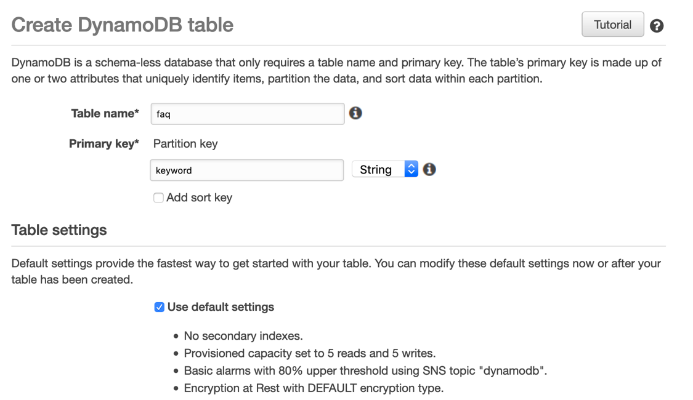

# Search common FAQs related to HR services
Search for commong searched questions ike Policy, Salary, Agent

## Demo


## We need to do following:
1. Create a DynamoDB table with name faq and with 
2. Write a search function that can extract the keywords from user input and search against DDB

## Steps
Navigate to DynamoDB console and create table as below


## Functions
```
def hrInfo(intent_request):
    ques = safeString(get_slots(intent_request)["Question"])
    source = intent_request['invocationSource']
    ques=ques.lower()
    
    keyword="default"
    if (ques.find("agent")>-1):
        keyword="agent"
    if (ques.find("policy")>-1):
        keyword="policy"
    if (ques.find("salary")>-1):
        keyword="salary"
    # if user put of some new quesiton, let connect him to human at the end
    if keyword=="default":
        keyword="agent"
    
    faq_result=scanFAQ(keyword)
    
    return close(intent_request['sessionAttributes'],
                 'Fulfilled',
                 {'contentType': 'PlainText',
                  'content': 'Thank you for your quesiton related to {}.\n\n{}'.format(keyword,faq_result)})
```
